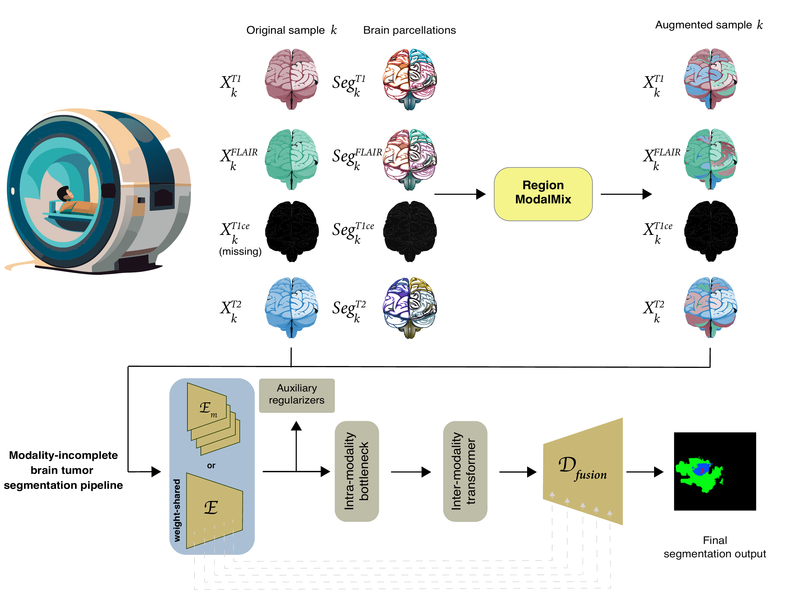

# Anatomy-guided, modality-agnostic segmentation of neuroimaging abnormalities

**Authors:** Diala Lteif, Divya Appapogu, Sarah A. Bargal, Bryan A. Plummer, Vijaya B. Kolachalama  

This work is published in _Human Brain Mapping_ (https://doi.org/10.1002/hbm.70329).

---

## Overview



This repository provides the implementation for our **anatomy-guided, modality-agnostic segmentation framework** for neuroimaging abnormalities. The approach is designed to improve model robustness and generalization under variable or missing MRI modality conditions, which is a common scenario in real-world clinical settings. Central to our work is **Region ModalMix** (RMM), a novel data augmentation strategy that leverages brain parcellation masks to mix information across modalities within anatomical regions. In so doing, RMM enhances the model’s ability to learn spatially coherent, modality-agnostic features that generalize across a wide range of missing data scenarios.
Our method also generalizes well to out-of-distribution data, further underscoring its robustness and utility in clinically realistic settings with distribution shifts, including anatomical variability in post-operative cases.
Our framework is applicable to multimodal neuroimaging pipelines more generalizable abnormality detection under heterogeneous data availability. 

## Setup

Clone the repository and install required packages:

```bash
git clone https://github.com/vkola-lab/hbm2025.git
cd hbm2025
pip install requirements.txt

```

## Dataset(s)

### Download

The models were trained and validated on the **BraTS 2020** dataset, which can be downloaded via [this](https://www.med.upenn.edu/cbica/brats2020/data.html) link.

We also evaluated our method on the out-of-distribution MU-Glioma-Post[2] dataset, which we downloaded via [this](https://www.cancerimagingarchive.net/collection/mu-glioma-post/) link. 

### Preprocessing

The preprocessing code is provided in `preprocess_dset.py`. We followed the preprocessing steps established by [RFNet](https://github.com/dyh127/RFNet) for both datasets.

### Generating Brain Parcellations

We used [SynthSeg](https://github.com/BBillot/SynthSeg) for the automated segmentation of the MRI scans. Please refer to their repo for setting up the SynthSeg tool and running with the `--parc` flag to generate cortical parcellations in addition to whole-brain segmentation. The resulting brain parcellation maps should contain labels for 101 regions including the background and cerebrospinal fluid (CSF).

***

After preprocessing, the data folder hierarchy should follow the structure below:
```
<DATASET>
|__ vol/
|   |__ <SUBJECT_ID>_vol.npy
|   |__ ...
|__ seg/
|   |__ <SUBJECT_ID>_seg.npy
|   |__ ...
|__ synthseg/
    |__ <SUBJECT_ID>_vol_synthseg.npy
    |__ ...

```

---

## Training

In this project, we use [Hydra](https://hydra.cc/) to manage configurations. To run training using Hydra, you need to specify the config filename through the `-cn` flag. The main config file we used is `configs/cfg_SEG.yaml`. It is provided as:
```
python main.py -cn cfg_SEG 
```

To edit dataset paths, or to train/validate on new datasets, you can add a new `yaml` file under `configs/dataset/`. For information about the Hydra Config setup, please check `config.py` where we defined all configuration variables.

The bash script `scripts/run_config.sh` contains the main commands for training, evaluation, and running WandB sweeps. To override config files and/or variables, use the `+file=<NEWFILE>` or `+file.variable=<NEWVARIABLE>` syntax, respectively.

To run training with our **Region ModalMix** method, override the following variables: ``++train.augment=RegionModalMix ++dataset.load_segmentations=True``.

---

## Citation

If you use this work, please cite:

```bibtex
@article{lteif2025anatomy,
  title={Anatomy-guided, modality-agnostic segmentation of neuroimaging abnormalities},
  author={Lteif, Diala and Appapogu, Divya and Bargal, Sarah A and Plummer, Bryan A and Kolachalama, Vijaya B},
  journal={medRxiv},
  year={2025},
  url={https://www.medrxiv.org/content/10.1101/2025.04.29.25326682v1}
}
```

